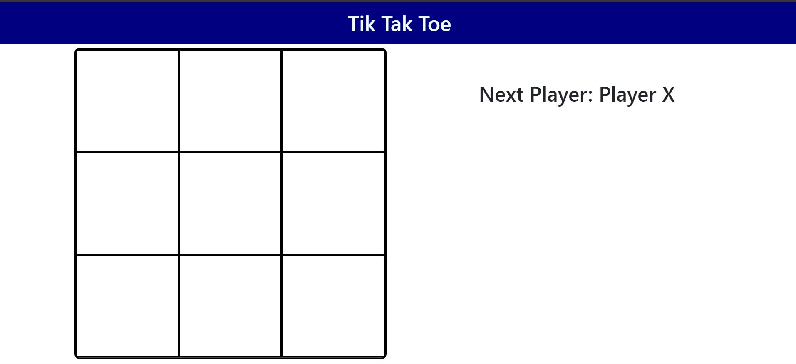
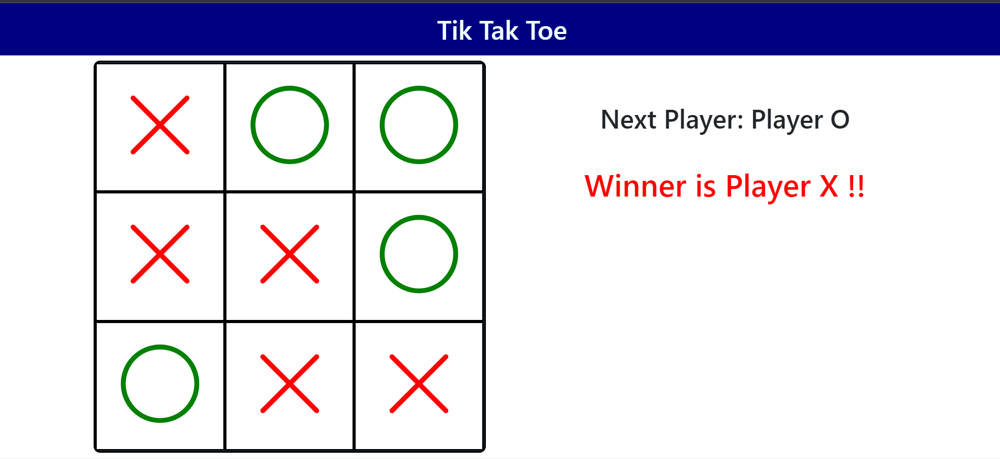

# Tik-Tak-Toe-Game

<div>


</div>

## Description:
  This program consists of jsx, html, css file.
  This program is Tik Tak Toe Game.

## Installation:
  1. Downloads each file into one file. <br>
    1. **index.html** <br>
    2. **tiktaktoe.jsx** <br>
    3. **styles.css** <br>
  2. Open shell and type **npm init -y**
     ```console
     npm init -y
     ```
  3. Type **npm install --global http-server**.
     ```console
     npm install --global http-server
     ```
  4. Type **npm install**.
     ```console
     npm install
     ```
  5. type **http-server -c-1** to start the server.
     ```console
     http-server -c-1
     ```
  6. Go online and type **localhost:8080** in URL box.

  
## Usage:
**[Live app](https://kojiroasano.github.io/Tik-Tak-Toe-Game/)**
  <p>If successfully installed and run on the Web browser, the Tik Tak Toe board shows up and play it!!</p>
  
## Support:
  If any question, message me via **[my twitter](https://twitter.com/Kojiro38895598)**.
  
## Roadmap of Future Improvements
  I would want to add the feature that if the player already fills in blank, the other player cannot fill in. Done!!
  
## License information: 
 please include the name of ***MIT***.

